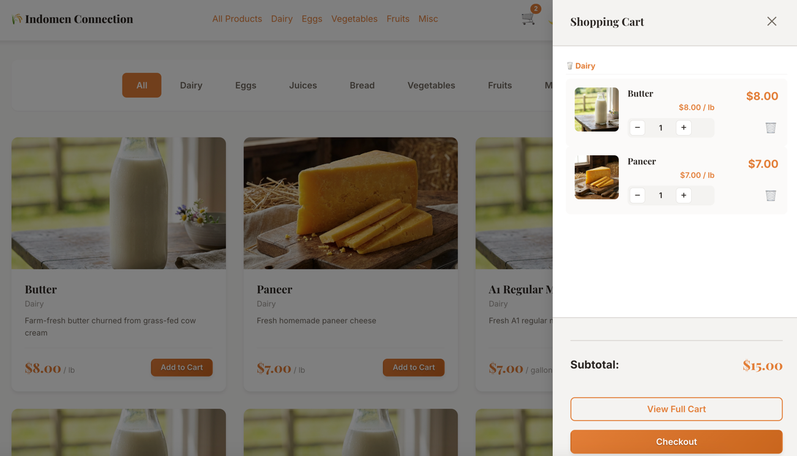
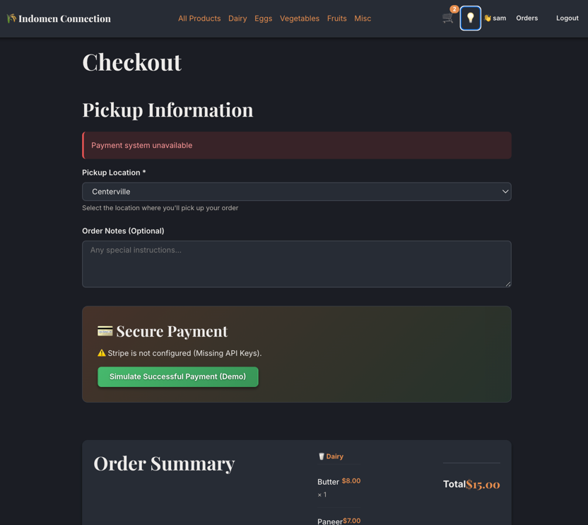
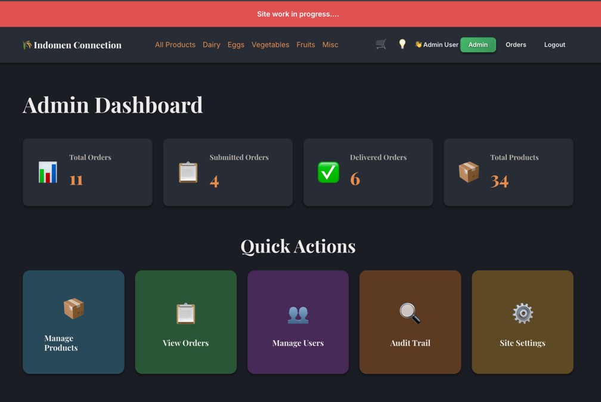
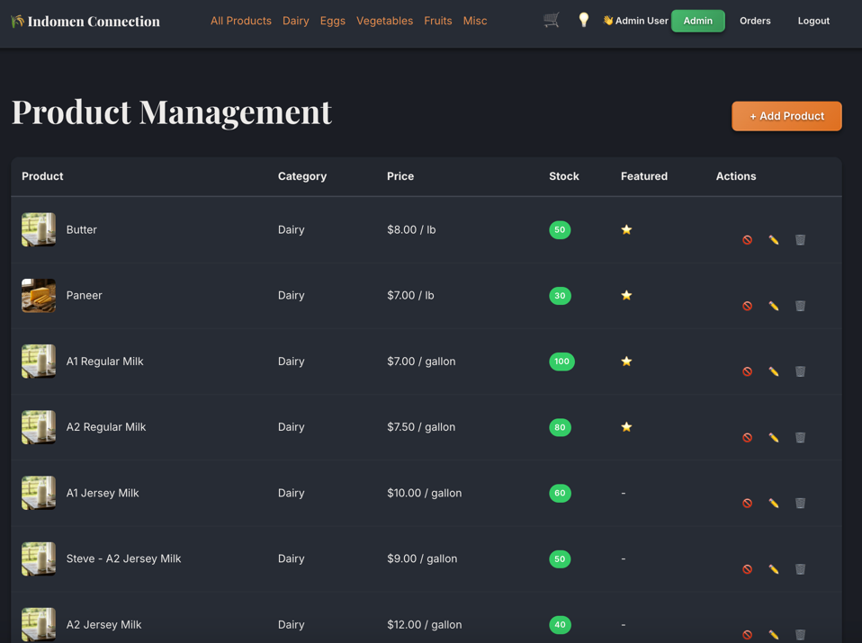
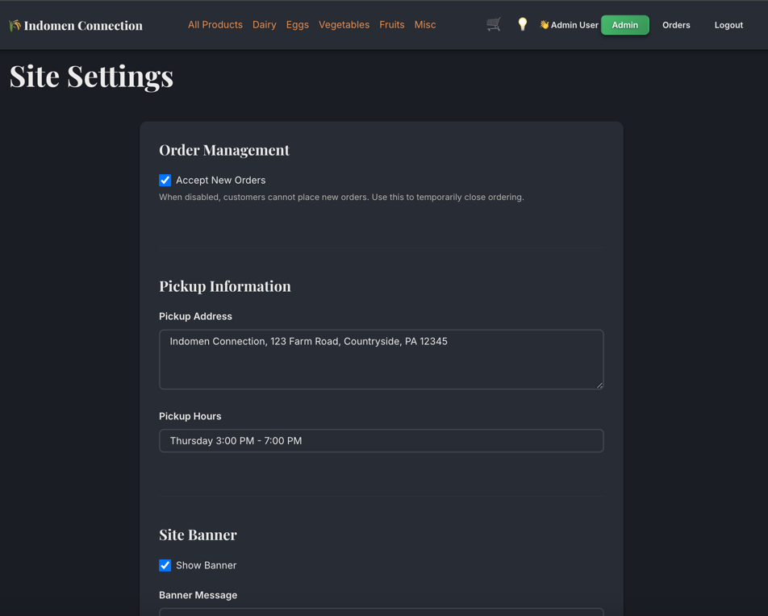
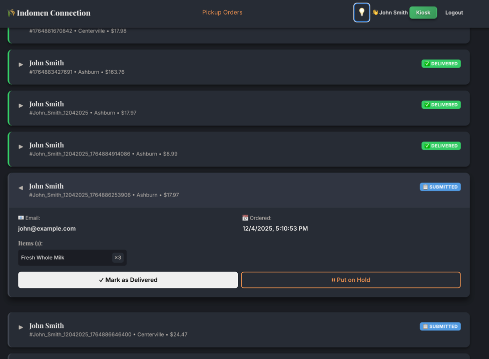

# 🥬 Farm to Table - Application Demo & User Guide

Welcome to **Farm to Table**, a modern web application for managing farm-to-table orders. This guide provides a walkthrough of the application's features for Customers, Administrators, and Kiosk Operators.

---

## 👥 User Roles

The application supports three distinct user roles, each with specific permissions and interfaces:

1.  **Customer**: Browses products, places orders, tracks order status, and manages account balance.
2.  **Admin**: Manages products, users, orders, credits/debits, analytics, and system settings.
3.  **Kiosk**: A specialized role for on-site staff to fulfill orders and manage pickups.

---

## 🛍️ Customer Experience

Customers must log in to access the full catalog and place orders.

### 1. **Product Catalog**
*   **Browse**: View high-quality images and details of fresh produce, bakery items, and more.
*   **Filter**: Easily filter products by category (Dairy, Eggs, Juices, Bread, Vegetables, Fruits, Misc).
*   **Search**: Find specific items instantly using the search bar.
*   **Advanced Filtering**: Filter by price range, availability, and more.

### 2. **Shopping Cart**
*   **Add to Cart**: Add items with a single click.
*   **Real-time Cart Sidebar**: View cart contents without leaving the page.
*   **Manage**: Adjust quantities or remove items directly from the cart.
*   **Real-time Total**: See the subtotal update instantly as you shop.

### 3. **Checkout Process**
*   **Review**: Verify items and total cost.
*   **Pickup Location**: Select a convenient pickup location (Ashburn, Centerville, Herndon, Fairfax).
*   **Apply Store Credits**: Use available credits to reduce order total.
*   **Pay Outstanding Balance**: Any owed amounts are automatically added to checkout.
*   **Secure Payment**: Pay securely using multiple methods via **Stripe Integration**:
    *   💳 Credit/Debit Cards (Visa, Mastercard, Amex)
    *   🍎 Apple Pay (on supported devices)
    *   G Google Pay (on supported devices)
    *   🔗 Link (Stripe's fast checkout)
    *   PayPal & Amazon Pay (if enabled in Stripe Dashboard)
*   **Contact Info**: Confirm phone number for order updates.
*   **Notes**: Add special instructions for the packing team.
*   **Order Confirmation**: Receive a unique Order ID upon success.

### 4. **Order Tracking**
*   **My Orders**: View a history of all past and current orders.
*   **Upcoming Weekend**: Orders organized by pickup weekend.
*   **Status Badges**: Track progress with clear status indicators:
    *   🔵 **SUBMITTED**: Order received.
    *   🟡 **HOLD**: Order on hold (e.g., someone holding your order for pickup).
    *   🟢 **DELIVERED**: Order picked up.

### 5. **Account Balance & Credits**
*   **Pay Outstanding Balance**: If you owe money (from previous charges), a prominent button appears in the header.
*   **Pay Balance Page**: Pay full or partial amounts using secure payment.
*   **Store Credits**: View and apply credits issued by admin at checkout.
*   **Balance History**: See all credit/debit transactions.

### 6. **Theme & Preferences**
*   **Dark/Light Mode**: Toggle between themes using the 🌙/💡 button.
*   **Responsive Design**: Works seamlessly on mobile, tablet, and desktop.

---

## 🛡️ Admin Dashboard

Admins have full control over the platform via a dedicated dashboard.

### 1. **Dashboard Overview**
*   **Key Metrics**: View real-time stats for Total Orders, Submitted Orders, Delivered Orders, and Total Products.
*   **Quick Actions**: One-click access to key management areas.
*   **Revenue Stats**: Track sales performance.

### 2. **Order Management**
*   **List View**: See all orders with sortable columns.
*   **Filtering**: Filter by status (Submitted, Hold, Delivered) or search by Order ID/Name.
*   **Order Details**: Click any **Order ID** to open a detailed modal showing:
    *   Customer contact info.
    *   Full item list with prices.
    *   Hold notes and special instructions.
    *   Credits/debits applied.
*   **Status Updates**: Manually update order statuses.
*   **WhatsApp Integration**: Quick contact customers via WhatsApp.

### 3. **Product Management**
*   **CRUD Operations**: Create, Read, Update, and Delete products.
*   **Inventory Control**: Update stock levels and prices.
*   **Image Upload**: Upload product images directly (with optimization).
*   **Category Management**: Organize products by category.

### 4. **User Management**
*   **User List**: View all registered users.
*   **Create Users**: Add new customer or kiosk accounts.
*   **Role Assignment**: Assign **Admin** or **Kiosk** roles.
*   **Edit/Delete**: Update user details or remove accounts.

### 5. **Sales Analytics**
*   **Dashboard Stats**: Revenue, order counts, trends.
*   **Pickup List Generator**: Generate pickup lists by date for fulfillment.
*   **Product Performance**: See which products sell best.

### 6. **Account Balances (Credits/Debits)**
*   **All Balances View**: See every customer's credit/debit balance in one page.
*   **Issue Credits**: Give customers store credit (e.g., for refunds, promotions).
*   **Issue Debits**: Charge customers for additional items purchased at pickup.
*   **Automatic Notifications**: Customers are notified when credits/debits are issued.
*   **Balance History**: Full transaction history per customer.

### 7. **Site Settings**
*   **Banner Management**: Create and display site-wide announcements.
*   **Order Acceptance**: Toggle whether the site accepts new orders.
*   **Pickup Locations**: Manage available pickup locations.

### 8. **Audit Log**
*   **Comprehensive Logging**: Track all sensitive actions (logins, order updates, product changes, credit/debit issuance).
*   **Who, What, When**: Full accountability trail.
*   **Filter & Search**: Find specific audit events.

### 9. **Kiosk Access**
*   Admin users can access the Kiosk Dashboard for order fulfillment.

---

## 🖥️ Kiosk Dashboard

Designed for fast-paced, on-site fulfillment centers.

### 1. **Optimized Interface**
*   **Compact View**: Displays many orders at once for quick scanning.
*   **Auto-Refresh**: The dashboard automatically updates every 30 seconds to show new orders.
*   **Customer Names Visible**: Each order clearly shows the customer name.

### 2. **Order Fulfillment**
*   **Search**: Instantly find orders by Customer Name, Email, or Order ID.
*   **Location Filter**: Filter orders by pickup location.
*   **Status Filter**: Show only Submitted, Hold, or Delivered orders.
*   **Expand Details**: Click to reveal order items and customer notes.
*   **Action Buttons**:
    *   **✓ Mark as Delivered**: Confirms the customer has picked up the order.
    *   **⏸ Put on Hold**: Flags an issue. Requires entering a mandatory note.

### 3. **Status Feedback**
*   **Visual Cues**: Color-coded borders and badges indicate status at a glance.
*   **Hold Notes**: Clearly displays *who* put the order on hold and *why*.
*   **WhatsApp Contact**: Message customers directly from the order.

---

## 💳 Payment System

### Supported Payment Methods
*   **Credit/Debit Cards** - Visa, Mastercard, American Express, Discover
*   **Apple Pay** - On Safari/iOS devices
*   **Google Pay** - On Chrome/Android devices
*   **Link** - Stripe's fast checkout with saved cards
*   **PayPal** - If enabled in Stripe Dashboard
*   **Amazon Pay** - If enabled in Stripe Dashboard

### Store Credits
*   Admins can issue credits for refunds, promotions, or order issues.
*   Customers can apply credits at checkout to reduce their total.

### Outstanding Balances
*   If a customer owes money, they see a "Pay $X.XX" button in the header.
*   They can pay their balance without placing an order.

---

## 🔐 Security Features

*   **RBAC (Role-Based Access Control)**: Strict middleware ensures users can only access authorized resources.
*   **Secure Sessions**: HttpOnly cookies and session management with persistence.
*   **Password Hashing**: All user passwords are securely hashed using bcrypt.
*   **Price Validation**: Server-side validation prevents price manipulation.
*   **Audit Logging**: Tracks "who did what and when" for compliance.
*   **SSL Encryption**: 256-bit SSL for all payment transactions.

---

## 🎨 Design Features

*   **Modern Typography**: Space Grotesk font for a clean, professional look.
*   **Dark/Light Theme**: User-selectable theme preference.
*   **Responsive Design**: Mobile-first approach with tablet/desktop support.
*   **Real-time Updates**: Cart sidebar, balance updates, order status.

---

## 🚀 Getting Started

1.  **Login**:
    *   **Admin**: `admin@freshfarm.com` / `password123`
    *   **Kiosk**: `kiosk@freshfarm.com` / `kiosk123`
    *   **Customer**: Use `john@example.com` / `password123` or `sarah@example.com` / `password123`
2.  **Explore**: Navigate using the top menu based on your role.
3.  **Theme**: Toggle dark/light mode with the 🌙/💡 button in the header.

---

## 📚 Additional Documentation

*   **[README.md](./README.md)** - Project overview and setup instructions
*   **[PAYMENT_INTEGRATION.md](./PAYMENT_INTEGRATION.md)** - Payment provider configuration
*   **[INVESTOR_PITCH.md](./INVESTOR_PITCH.md)** - Business overview for investors
